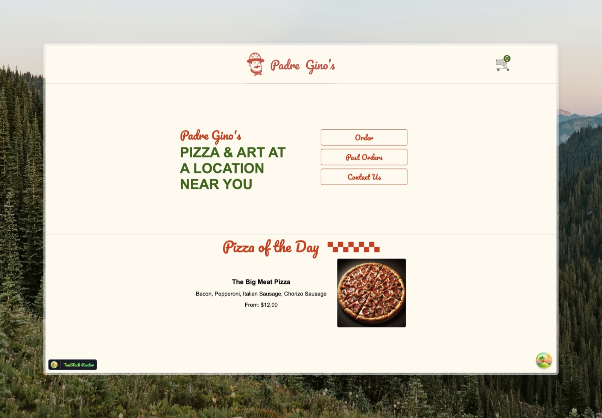
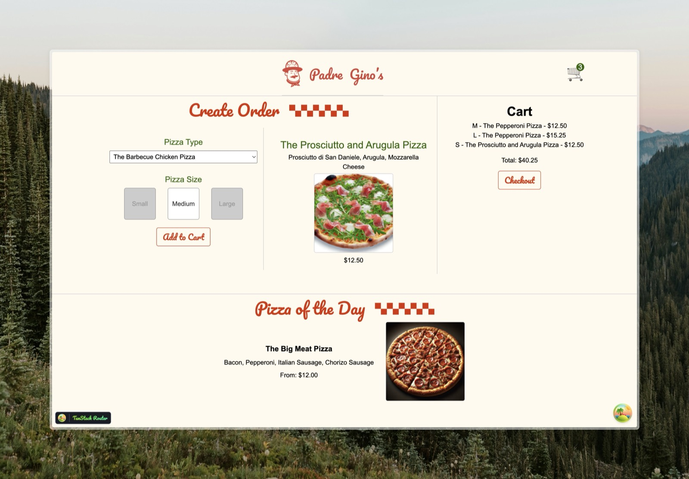
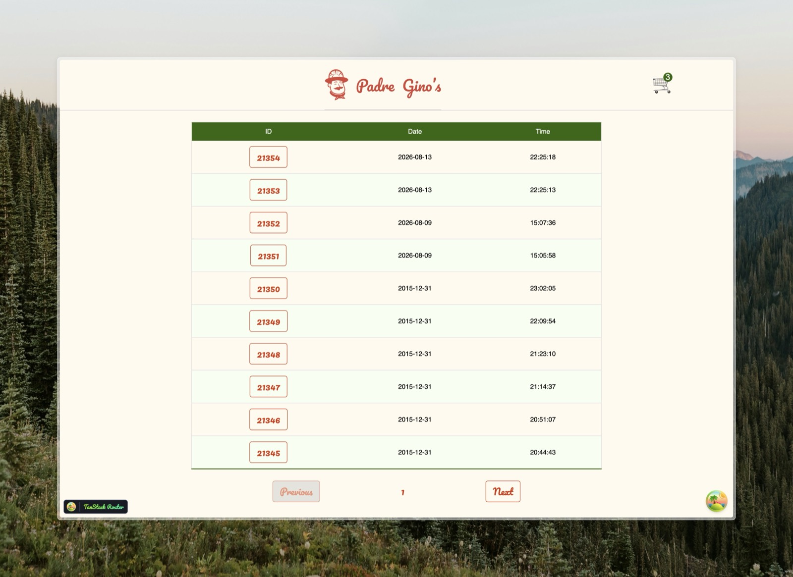
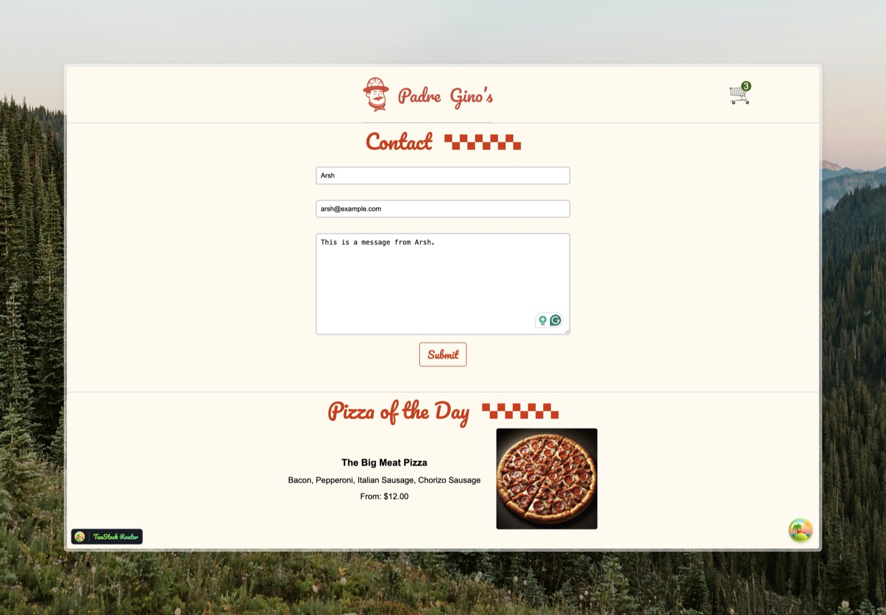

# Padre Gino's 🍕

A pizza ordering app built with React 19, TanStack Router, and TanStack Query, backed by a small Fastify + SQLite API.

This project is part of my journey while learning React — it's an introductory project I built to get comfortable with the core ideas (components, hooks, routing, data fetching, and testing).

> Not deployed anywhere, so the screenshots below show what it looks like.

---

## Screenshots

**Home** — landing page with links to the three main pages, plus the "Pizza of the Day" section that shows on every page.



**Order** — pick a pizza type and size, see the price update, add items to the cart, and check out.



**Past Orders** — paginated list of previous orders. Clicking an order ID opens the details in a modal.



**Contact** — a simple contact form that posts to the API.



---

## What's in this repo

```
.
├── api/            # Fastify server + SQLite database (the backend)
├── padre-ginos/    # React app built with Vite (the frontend)
└── screenshots/    # Images used in this README
```

Two separate projects, each with their own `package.json`. You run both at the same time during development.

---

## Getting started

You'll need Node.js installed. Open two terminals.

**1. Start the API (port 3000)**

```bash
cd api
npm install
npm run dev
```

**2. Start the React app (port 5173)**

```bash
cd padre-ginos
npm install
npm run dev
```

Then open http://localhost:5173.

The frontend never talks to port 3000 directly. Vite is configured to proxy `/api` and `/public` requests over to the API server, so the browser sees everything on one origin and there are no CORS issues.

---

## How the API works

The API is a single [Fastify](https://fastify.dev/) server (`api/server.js`) that reads from a SQLite file (`api/pizza.sqlite`) containing real-ish pizza and order data. It also serves the pizza images, the stylesheet, and the font from `api/public/`.

| Method | Endpoint | What it does |
| --- | --- | --- |
| `GET` | `/api/pizzas` | All pizzas, each with its sizes and prices (`{ S, M, L }`) |
| `GET` | `/api/pizza-of-the-day` | One pizza, picked using the number of days since the epoch — so it changes daily but stays the same all day |
| `GET` | `/api/orders` | Every order (id, date, time) |
| `GET` | `/api/order?id=<id>` | One order with its items and a calculated total |
| `POST` | `/api/order` | Creates an order from a cart. Duplicate pizzas are merged into quantities and everything is written inside a transaction |
| `GET` | `/api/past-orders?page=<n>` | Past orders, 10 per page |
| `GET` | `/api/past-order/:order_id` | A single past order with its items and total |
| `POST` | `/api/contact` | Validates name/email/message and logs the submission |

A couple of details worth knowing:

- **Prices aren't stored on the pizza.** They live in a separate `pizzas` table, one row per pizza + size. The API joins them and reshapes the result into a `sizes` object so the frontend can just read `pizza.sizes.M`.
- **Some endpoints are deliberately slow.** `/api/past-orders` sleeps for 5 seconds on purpose. That was there so I could actually see loading states, `<Suspense>` fallbacks, and caching behavior instead of everything resolving instantly.

---

## How the frontend works

### Routing

File-based routing with [TanStack Router](https://tanstack.com/router). Each file in `src/routes/` becomes a route, and `routeTree.gen.ts` is generated automatically by the Vite plugin — I never edit it by hand.

- `__root.jsx` — the layout wrapping every page (header, `<Outlet />`, Pizza of the Day, cart context)
- `index.lazy.jsx` — `/`
- `order.lazy.jsx` — `/order`
- `past.lazy.jsx` — `/past`
- `contact.lazy.jsx` — `/contact`

The `.lazy` in the filenames means those route components are code-split and only downloaded when you visit them.

### State and data

The app intentionally uses a few different approaches, because the point was to learn each one:

- **`useState` + `useEffect` + `fetch`** — the order page fetches pizzas the manual way
- **A custom hook** — `usePizzaOfTheDay.jsx` wraps that same pattern behind a reusable hook (and uses `useDebugValue` so it reads nicely in React DevTools)
- **Context** — the cart is a `useState` pair passed through `CartContext`, so the header can show the cart count without prop drilling
- **TanStack Query** — the past orders page uses `useQuery` with `staleTime` for caching, pagination, and the `enabled` flag to only fetch order details once you click a row

### React 19 features used

- `use()` to read a promise inside a component (past orders) and to read context (header)
- `<Suspense>` for the loading fallback while that promise resolves
- `action={...}` on forms instead of `onSubmit` handlers
- `useFormStatus()` to disable the contact inputs while the form is submitting
- The React Compiler, enabled via a Babel plugin — so no manual `useMemo` / `useCallback`

### Other pieces

- `Modal.jsx` — renders into a separate `#modal` div using `createPortal`
- `ErrorBoundary.jsx` — a class component (error boundaries still have to be classes) that catches render errors and shows a link back home

---

## Testing

Tests use [Vitest](https://vitest.dev/) with a workspace setup that runs them in **two different environments**:

- `*.node.test.jsx` — fast tests in `happy-dom`, a simulated DOM
- `*.browser.test.jsx` — tests in real Chromium via Playwright

```bash
cd padre-ginos
npm test           # run the tests
npm run test-ui    # run them in Vitest's UI
npm run coverage   # coverage report
```

What's covered: component rendering, snapshot tests for the cart, the custom hook (with mocked `fetch`), form submission, and the error boundary's fallback.

---

## Scripts

**`padre-ginos/`**

| Command | Description |
| --- | --- |
| `npm run dev` | Start the Vite dev server |
| `npm run build` | Build for production |
| `npm run preview` | Preview the production build |
| `npm run lint` | Run ESLint |
| `npm run format` | Format with Prettier |
| `npm test` | Run tests |

**`api/`**

| Command | Description |
| --- | --- |
| `npm run dev` | Start the server with `--watch` |
| `npm start` | Start the server |

---

## Tech stack

React 19 · Vite · TanStack Router · TanStack Query · React Compiler · Vitest · Playwright · Testing Library · Fastify · SQLite · ESLint · Prettier

---

## Credits

Built while following Brian Holt's [Complete Intro to React](https://react.holt.courses/) course on Frontend Masters. The API, database, and design assets come from the course materials; the React app is my own work through the lessons.
